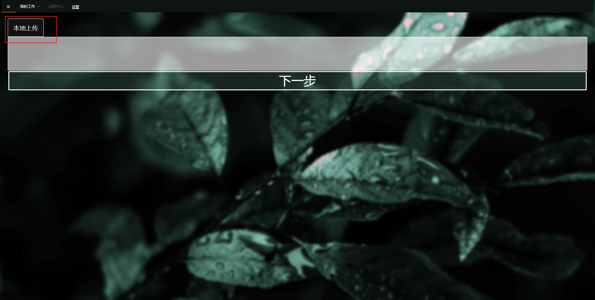
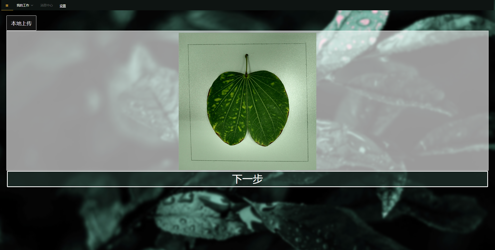
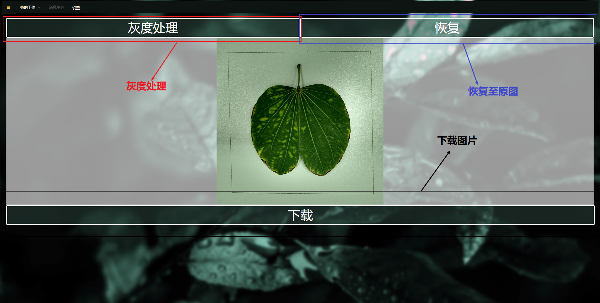
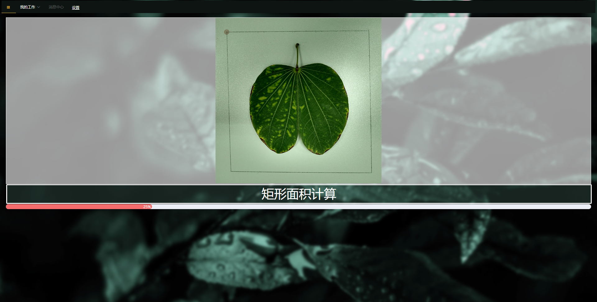
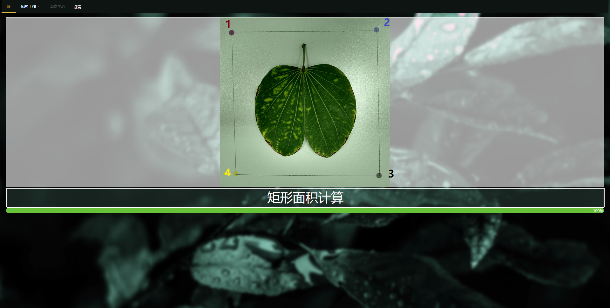
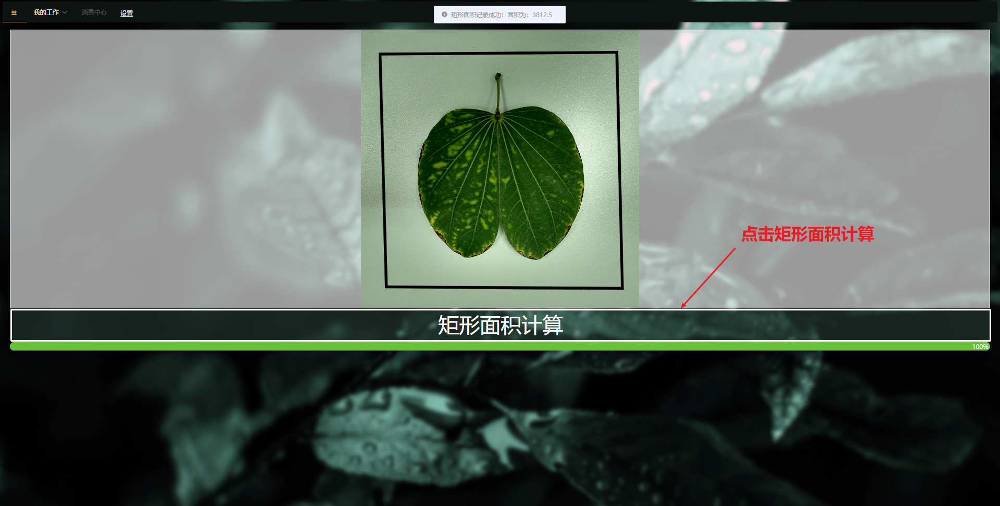

<!-- START doctoc generated TOC please keep comment here to allow auto update -->
<!-- DON'T EDIT THIS SECTION, INSTEAD RE-RUN doctoc TO UPDATE -->
**Table of Contents**  *generated with [DocToc](https://github.com/thlorenz/doctoc)*

- [image-peocessing](#image-peocessing)
  - [项目介绍](#%e9%a1%b9%e7%9b%ae%e4%bb%8b%e7%bb%8d)
  - [操作步骤](#%e6%93%8d%e4%bd%9c%e6%ad%a5%e9%aa%a4)
    - [上传图片](#%e4%b8%8a%e4%bc%a0%e5%9b%be%e7%89%87)
    - [灰度处理](#%e7%81%b0%e5%ba%a6%e5%a4%84%e7%90%86)
    - [矩形面积计算](#%e7%9f%a9%e5%bd%a2%e9%9d%a2%e7%a7%af%e8%ae%a1%e7%ae%97)
  - [算法原理](#%e7%ae%97%e6%b3%95%e5%8e%9f%e7%90%86)
    - [灰度处理原理](#%e7%81%b0%e5%ba%a6%e5%a4%84%e7%90%86%e5%8e%9f%e7%90%86)
    - [四点坐标计算矩形面积](#%e5%9b%9b%e7%82%b9%e5%9d%90%e6%a0%87%e8%ae%a1%e7%ae%97%e7%9f%a9%e5%bd%a2%e9%9d%a2%e7%a7%af)
  - [项目安装](#%e9%a1%b9%e7%9b%ae%e5%ae%89%e8%a3%85)
    - [在开发环境进行编译和热加载使用](#%e5%9c%a8%e5%bc%80%e5%8f%91%e7%8e%af%e5%a2%83%e8%bf%9b%e8%a1%8c%e7%bc%96%e8%af%91%e5%92%8c%e7%83%ad%e5%8a%a0%e8%bd%bd%e4%bd%bf%e7%94%a8)
    - [在生产环境中编译使用](#%e5%9c%a8%e7%94%9f%e4%ba%a7%e7%8e%af%e5%a2%83%e4%b8%ad%e7%bc%96%e8%af%91%e4%bd%bf%e7%94%a8)
    - [运行你的 tests](#%e8%bf%90%e8%a1%8c%e4%bd%a0%e7%9a%84-tests)
    - [检查修复你的文件](#%e6%a3%80%e6%9f%a5%e4%bf%ae%e5%a4%8d%e4%bd%a0%e7%9a%84%e6%96%87%e4%bb%b6)
    - [自定义配置](#%e8%87%aa%e5%ae%9a%e4%b9%89%e9%85%8d%e7%bd%ae)

<!-- END doctoc generated TOC please keep comment here to allow auto update -->

# image-peocessing
## 项目介绍

本项目，为了完成毕设设计。项目中使用了vue2+element-ui+js来实现相关植物叶片面积的计算。

## 操作步骤
### 上传图片
请按红框进行操作




### 灰度处理


### 矩形面积计算
首先,依次从上到下从左到右,点击矩形四个角点:



最后点击计算矩形面积计算其矩形值:


-----------

## 算法原理
### 灰度处理原理
灰度处理,现阶段常用的有三种方法,`分量法`,`最大值法`和`平均值法`.本项目灰度处理默认采用常用的**平均值法**.

1 分量法:
  将彩色图像中的三分量的亮度作为三个灰度图像的灰度值,可根据需要选取一种灰度图像.

$$Gray_1(i,j) = R(i,j)$$
$$Gray_2(i,j) = G(i,j) $$
$$Gray_3(i,j) = B(i,j) $$

2 最大值法:
  将彩色图像中的三分量亮度的最大值作为灰度图的灰度值.
  $$Gray(i,j) = max\{R(i,j),G(i,j),B(i,j)\}$$

3 平均值法:
  将彩色图像中的三分量亮度求平均得到一个灰度值.
  $$Gray(i,j) = \frac{(R(i,j) + G(i,j) + B(i,j))}{3}$$

### 四点坐标计算矩形面积
可以将矩形分解为两个三角形相加,假设三角形三个点$A(x_1,y_1),B(x_2,y2),C(x_3,y_3)$,这根据线代知识可以知道
$$S_▲ = \frac{ \left\{ \begin{matrix}
  x_1 & y_1 & 1 \\
  x_2 & y_2 & 1 \\
  x_3 & y_3 & 1
\end{matrix} \right\} }{2}$$
可得:
$$S_▲ = \frac{(x_1y_2+x_2y_3+x_3y_1-x_1y_3-x_2y_1-x_3y_2)}{2}$$
则矩形面积:
$$S_■ = 2S_▲$$

## 项目安装
```
yarn install
```
或者
```
npm i
```

### 在开发环境进行编译和热加载使用
```
yarn run serve
```
或者
```
npm run serve
```

### 在生产环境中编译使用
```
yarn run build
```

### 运行你的 tests
```
yarn run test
```

### 检查修复你的文件
```
yarn run lint
```

### 自定义配置
See [Configuration Reference](https://cli.vuejs.org/config/).
